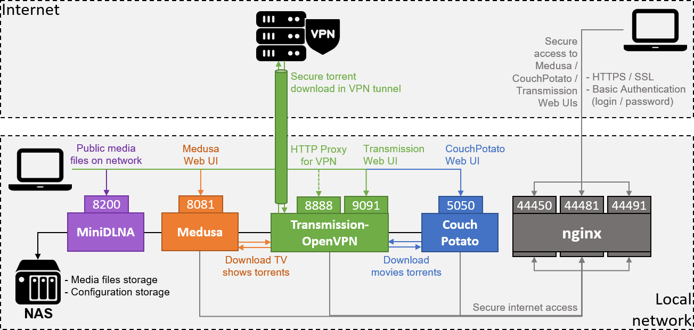

# Docker Torrent Factory
Docker compose dedicated to ARMv7 processors, hosting a complete torrent factory.<br />
<br />
This project is based on existing projects, combined and modified to work on ARMv7 WD My Cloud EX2 Ultra NAS.<br />
See GitHub repositories / Docker Hub images:
| Container | URLs |
|-----------|------|
| Transmission-OpenVPN | <ul><li>https://github.com/haugene/docker-transmission-openvpn</li><li>https://hub.docker.com/r/haugene/transmission-openvpn</li></ul>|
| Medusa | <ul><li>https://github.com/linuxserver/docker-medusa</li><li>https://hub.docker.com/r/linuxserver/medusa</li></ul>|
| CouchPotato | <ul><li>https://github.com/linuxserver/docker-couchpotato</li><li>https://hub.docker.com/r/linuxserver/couchpotato</li></ul>|
| MiniDLNA | <ul><li>https://github.com/vladgh/docker_base_images/tree/master/minidlna</li><li>https://hub.docker.com/r/vladgh/minidlna</li></ul>|
| nginx | <ul><li>https://github.com/nginxinc/docker-nginx</li><li>https://hub.docker.com/_/nginx</li></ul>|

## What is it ?

Blabla



### Prerequisite

On WD MyCloud EX2 Ultra, you need to replace the old docker install by a fresh one, with docker-compose.
For this, follow these steps:
* Connect to the NAS with SSH as `root` user (see manualffor details)
* Stop the docker daemon: `/usr/sbin/docker_daemon.sh stop`
* Download the following apps from the WD community site: https://wdcommunity.com/
  * Last version of Entware: `MyCloudEX2Ultra_entware_1.05.bin`
  * Last version of Docker: `MyCloudEX2Ultra_docker_19.03.5.bin`
* Install the downloaded apps using the MyCloud web UI: upload and install apps (see manual for details)
* Install and upgrade python3 and pip :
```bash
$ # Install on MyCloud EX2 Ultra
$ opkg update
$ opkg install python3-pip
$ pip3 install --upgrade pip
```
* Install docker-compose :
```bash
$ pip install setuptools
$ # Install on MyCloud EX2 Ultra : limit to 1.23.x, because >=1.24 requires to build crypto libs in ARM (not possible with opkg because of lack of dev packages)
$ pip install docker-compose~=1.23.0
```

On other NAS / Raspberry Pi devices, just install last versions of docker and docker-compose.

### Directories

The configuration of all the containers are stored on volumes, mapped with the docker host.

```bash
shares/P2P/tools
├── couchpotato       # Contains CouchPotato configuration, database, cache and logs
│   ├── config.ini    # CouchPotato configuration file (use configurator to initialize, use Web UI for setup)
│   └── ...
├── medusa            # Contains Medusa configuration, database, cache and logs
│   ├── config.ini    # Medusa configuration file (use configurator to setup, use Web UI for full setup)
│   └── ...
├── minidlna          # Contains MiniDLNA database cache (delete content to force reindex)
│   └── ...
├── nginx             # Contains nginx configuration, passwords and logs
│   ├── nginx.conf    # nginx configuration file (use configurator to setup)
│   ├── passwords     # nginx credentials for basic authentication (use configurator to setup)
│   └── logs          # nginx logs
├── ssl               # Contains certificates for nginx HTTPS access 
│   └── ...           # **GENERATE FILES .crt AND .key HERE**
└── transmission      # Contains Transmission configuration, cache and logs
    ├── settings.json # Transmission configuration file (do not modify, overwritten by transmission-openvpn)
    └── ...
```

```bash
storage
├── _hd1            # External hard-drive #1
│   ├── Enfants     # Children videos
│   │   ├── Films   # Children movies on HD1, managed by CouchPotato
│   │   ├── Series  # Children TV shows on HD1, managed by Medusa
│   │   └── ...
│   ├── Films       # Movies on HD1, managed by CouchPotato
│   ├── Series      # TV shows on HD1, managed by Medusa
│   └── ...
├── ...
├── complete        # Downloaded torrents, published with MiniDLNA
│   ├── couchpotato # Downloaded torrents, managed by CouchPotato 
│   ├── medusa      # Downloaded torrents, managed by Medusa
│   └── seed        # Seeding torrents
├── incomplete      # Currently downloading torrents
├── watch           # Watch directory for *.torrent files
├── ...
├── Backup          # Old personal photos & videos, published with MiniDLNA and published with MiniDLNA
├── Films           # Movies on NAS, managed by CouchPotato and published with MiniDLNA
├── MP3             # Music on NAS, published with MiniDLNA
├── Photos          # Personal photos & videos to publish with MiniDLNA
├── Series          # TV shows on NAS, managed by Medusa and published with MiniDLNA
└── Videos          # Misc videos on NAS, published with MiniDLNA
```

## Installation

### Preparation
Before running the containers, you have to retrieve UID and GID for the user used to mount your directories (configuration, medias):
* Get user UID:
```
$ id -u <user>
```
* Get user GID:
```
$ id -g <user>
```
The containers will run impersonated as this user, in order to have read/write access to the tv shows directory.
