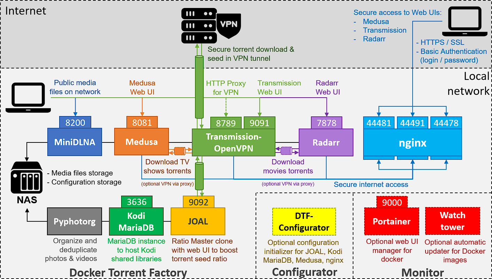

# Docker Torrent Factory
Docker compose dedicated to ARM / x86 / x64 processors, hosting a complete torrent factory or seedbox

This project is based on existing projects, combined and configured to work on a docker-compatible NAS, or any docker-compatible device (like Raspberry Pis).

See GitHub repositories / Docker Hub images:
| Container | URLs |
|-----------|------|
| **Transmission-OpenVPN**<br />Torrent server secured by VPN connection | <ul><li>https://github.com/haugene/docker-transmission-openvpn</li><li>https://hub.docker.com/r/haugene/transmission-openvpn</li></ul>|
| **Jackett**<br />API Support for your favorite torrent trackers  | <ul><li>https://github.com/Jackett/Jackett</li><li>https://hub.docker.com/r/linuxserver/jackett</li></ul>|
| **JOAL**<br />Ratio Master clone with web UI to boost torrent seed ratio | <ul><li>https://github.com/anthonyraymond/joal</li><li>https://hub.docker.com/r/anthonyraymond/joal</li></ul>|
| **Medusa**<br />TV shows manager and auto-downloader, connected to torrent server | <ul><li>https://github.com/linuxserver/docker-medusa</li><li>https://hub.docker.com/r/linuxserver/medusa</li></ul>|
| **Radarr**<br />Movies manager and auto-downloader, connected to torrent server | <ul><li>https://github.com/Radarr/Radarr</li><li>https://hub.docker.com/r/linuxserver/radarr</li></ul>|
| **nginx**<br />Reverse proxy, used to expose services as HTTPS with SSL certificates and basic authentication | <ul><li>https://github.com/nginxinc/docker-nginx</li><li>https://hub.docker.com/_/nginx</li></ul>|
| **MiniDLNA**<br />UPnP / DLNA service, used to publish media files on the local network | <ul><li>https://github.com/vladgh/docker_base_images/tree/master/minidlna</li><li>https://hub.docker.com/r/vladgh/minidlna</li></ul>|
| **MariaDB**<br />Database service, used to host and share video and music databases for Kodi clients on the local network | <ul><li>https://github.com/linuxserver/docker-mariadb</li><li>https://hub.docker.com/r/linuxserver/mariadb</li></ul>|
| **Pyphotorg**<br />Photo organizer and deduplicator, used to manage photos / videos on the NAS | <ul><li>https://github.com/ahuh/docker-torrent-factory/tree/master/pyphotorg</li><li>https://hub.docker.com/r/ahuh/pyphotorg</li></ul>|

Table of contents:
- [Docker Torrent Factory](#docker-torrent-factory)
  - [1) How does it work ?](#1-how-does-it-work-)
  - [2) Features](#2-features)
  - [3) Prerequisites](#3-prerequisites)
    - [3.1) VPN subscription](#31-vpn-subscription)
    - [3.2) SSL certificates](#32-ssl-certificates)
    - [3.3) Docker installation](#33-docker-installation)
      - [3.3.1) QNAP NAS](#331-qnap-nas)
      - [3.3.2) WD MyCloud EX2 Ultra OS3](#332-wd-mycloud-ex2-ultra-os3)
      - [3.3.3) General instructions](#333-general-instructions)
  - [4) Installation](#4-installation)
    - [4.1) Preparation](#41-preparation)
    - [4.2) Directories](#42-directories)
      - [4.2.1) Directory structure on host-side](#421-directory-structure-on-host-side)
      - [4.2.2) Directory structure on container-side](#422-directory-structure-on-container-side)
    - [4.3) Prepare environment file](#43-prepare-environment-file)
  - [5) Usage](#5-usage)
    - [5.1) Launch for the first time](#51-launch-for-the-first-time)
    - [5.2) Launch or update DTF services](#52-launch-or-update-dtf-services)
    - [5.3) Terminate DTF or Monitor services](#53-terminate-dtf-or-monitor-services)
    - [5.4) Other commands](#54-other-commands)
  - [6) Additional configuration](#6-additional-configuration)

## 1) How does it work ?
This repository contains a main `docker-compose.yml` file, configured to launch each dedicated service (docker containers). This diagram explains how it works:<br /><br />


Other docker compose files are available :
* The `docker-compose-configurator.yml` file is provided to deploy a **Configurator** service, that you may optionally use to automatically configure each service to work together. This one is a "one-shot" process: you may launch it one time before launching the main docker-compose file, in order to generate the configuration files for each service (not possible for Radarr: must be manually configured in web UI). Note that you still can configure each service with the dedicated web UI (Medusa, Radarr, etc) to do additional settings.
* The `docker-compose-monitor.yml` file is provided to deploy a **Portainer** service that you may use to monitor and manage your docker environment with a web UI, and a **Watchtower** service that automatically updates docker images and containers.

## 2) Features
* **VPN integration** to secure peer-to-peer downloads and uploads
* **Bittorent client** with web UI (Transmission)
* Bittorrent **ratio booster** with web UI (JOAL)
* **Automatic downloader for TV shows** (Medusa), connected to the Bittorent client
* **Automatic downloader for movies** (Radarr), connected to the Bittorent client
* **API Proxy for torrent trackers** (Jackett), connected to the automatic donwloader for TV shows
* **Reverse-proxy** (nginx), securing (basic authentication, SSL certificates) and exposing services on internet (Medusa, Radarr, Transmission)
* **UPnP / DLNA** server (MiniDLNA) to broadcast your media files in your local network
* **HTTP Proxy server** to share the VPN connection in your local network
* **Shared video and music databases** (MariaDB) for Kodi clients in your local network
* **Personal photos / videos organizer and deduplicator** (Pyphotorg), executed once a week
* **Configurator service** (DTF-Configurator) available to initialize configuration files for all services
* **Monitor services** (Portainer and Watchtower) available to manager docker with web UI, and to automatically update all container and images once a day
* **Selection of services to enable** using an environment config file (you do not need to use everything !)

## 3) Prerequisites

### 3.1) VPN subscription
You need a VPN subscription before installing the torrent factory. You will have to specify the VPN provider, user login and password to use in the OpenVPN service. See supported providers here: http://haugene.github.io/docker-transmission-openvpn/supported-providers/

### 3.2) SSL certificates
If you wish to secure external access to your services web UIs with nginx, you will need to provide an SSL certificate. A self-signed certificate will do the trick, for example see this tutorial for generation: https://devcenter.heroku.com/articles/ssl-certificate-self. You will have to provide two files : `server.key` and `server.crt`.

### 3.3) Docker installation
You have to install Docker on the device or NAS that will host the Docker Torrent Factory.

#### 3.3.1) QNAP NAS
Install the `Container Station` add-on in the QTS web UI, and enable SSH access. It provides docker and docker compose available in SSH.

#### 3.3.2) WD MyCloud EX2 Ultra OS3
On WD MyCloud EX2 Ultra, you need to replace the old docker install by a fresh one, and then install docker-compose.
For this, follow these steps:
* Connect to the NAS with SSH as `root` user (see manual for details)
* Stop the docker daemon: `/usr/sbin/docker_daemon.sh stop`
* Download the following apps from the WD community site: https://wdcommunity.com/
  * Last version of Entware: `MyCloudEX2Ultra_entware_1.05.bin`
  * Last version of Docker: `MyCloudEX2Ultra_docker_19.03.8.bin`
* Install the downloaded apps using the MyCloud web UI: upload and install apps (see manual for details)
* Install and upgrade python3 and pip :
```bash
$ # Install on MyCloud EX2 Ultra
$ opkg update
$ opkg install python3-pip
$ pip3 install --upgrade pip
```
* Install docker-compose :
```bash
$ pip install setuptools
$ # Install on MyCloud EX2 Ultra : limit to 1.23.x, because >=1.24 requires to build crypto libs in ARM
$ #   (not possible with opkg because of lack of dev packages)
$ pip install docker-compose~=1.23.0
```

#### 3.3.3) General instructions
On other NAS / Raspberry Pi devices, just install last versions of docker and docker-compose.

## 4) Installation
Clone this repo in a shared directory on your NAS / device. You may now adapt the files to your environment.

### 4.1) Preparation
Before running the containers, you have to retrieve UID and GID for the user used to mount your directories (configuration, medias):
* Connect to the NAS with SSH as `root` user, or as a sudoer user
* Go to the shared directories that contains the media files stored on your NAS: `cd /share/<name-of-share>`
* Check the `<user>` owner of the files: `ls -l`
* Get user UID:
```
$ id -u <user>
```
* Get user GID:
```
$ id -g <user>
```
The containers will run impersonated as this user, in order to have read/write access to the media directories.

### 4.2) Directories
The configuration of all the containers are stored on volumes, mapped with the docker host.

#### 4.2.1) Directory structure on host-side
For tools configuration and logs (JOAL, Kodi MariaDB, Medusa, MiniDLNA, nginx, Radarr, Transmission):

```bash
/share/Download/tools
├── joal              # Contains JOAL configuration files (use dtf-configurator to initialize)
|   ├── config.json   # JOAL configuration file (use dtf-configurator to setup)
│   ├── clients       # JOAL clients dir
│   └── torrents      # JOAL torrents dir
├── kodi-mariadb      # Kodi MariaDB configuration, database and logs
│   └── initdb.d      # Initialization scripts dir (use dtf-configurator to setup)
│       └── kodi.sql  # Kodi DB initialization script (use dtf-configurator to setup)
├── medusa            # Contains Medusa configuration, database, cache and logs
│   ├── config.ini    # Medusa configuration file (use dtf-configurator to setup, use Web UI for full
│   └── ...           #   setup)
├── minidlna          # Contains MiniDLNA database cache (delete content to force reindex)
│   └── ...
├── nginx             # Contains nginx configuration, passwords and logs
│   ├── nginx.conf    # nginx configuration file (use dtf-configurator to setup)
│   ├── passwords     # nginx credentials for basic authentication (use dtf-configurator to setup)
│   └── logs          # nginx logs
├── radarr            # Contains Radarr configuration, database, cache and logs
│   └── ...           #   (do not modify, managed by Radarr with Wed UI)
├── ssl               # Contains certificates for nginx HTTPS access 
│   └── ...           # **GENERATE FILES .crt AND .key HERE**
└── transmission      # Contains Transmission configuration, cache and logs
    ├── settings.json # Transmission configuration file (do not modify, overwritten by
    └── ...           #   transmission-openvpn)
```

You have to create the `tools` dir on your NAS / device, before launching the configurator service that will initialize the directory structure and configuration files.

See `docker-compose.yml` and `docker-compose-configurator.yml` configuration: adapt it to your own environment.

#### 4.2.2) Directory structure on container-side
For storage (photos, videos, TV shows, movies, music, torrents):

```bash
storage
├── complete        # Downloaded torrents by Transmission, published with MiniDLNA
│   ├── medusa      # Downloaded torrents by Transmission, managed by Medusa
│   ├── radarr      # Downloaded torrents by Transmission, managed by Radarr
│   └── seed        # Seeding torrents, managed by Transmission
├── incomplete      # Currently downloading torrents, managed by Transmission (currently disabled)
├── watch           # Watch directory for *.torrent files, consumed by Transmission
├── ...
├── Backup          # Old personal photos & videos and published with MiniDLNA
│   ├── pyphotorg   # Backup photos & videos and logs, managed by Pyphotorg (backup for
│   └── ...         #   deduplicate operation)
├── Photos          # Personal photos & videos, managed by Pyphotorg (dir for deduplicate
|   |               #   operation) and published with MiniDLNA
|   ├── Mobile XXX  # Organized photos & videos from smartphone XXX, managed by Pyphotorg (target
|   |               #   for move/organize operation from '/sync/backup-XXX')
|   ├── Mobile ...  # Other smartphone dirs, managed by Pyphotorg
│   └── ...
├── sync            # Sync directory, where smartphone camera files are copied (on QNAP, with
|   |               #   QSync), managed by Pyphotorg (source for move/organize operation)
|   ├── camera-XXX  # Photos & videos backed-up from smartphone XXX, managed by Pyphotorg
|   |               #   (source for move/organize operation to '/storage/Photos/Mobile XXX')
|   ├── camera-...  # Other smartphone dirs, managed by Pyphotorg
|   └── ...
├── Enfants         # Children videos
│   ├── Films       # Children movies on NAS, managed by Radarr and published with MiniDLNA
│   ├── Series      # Children TV shows on NAS, managed by Medusa and published with MiniDLNA
│   └── ...
├── Films           # Movies on NAS, managed by Radarr and published with MiniDLNA
├── MP3             # Music on NAS, published with MiniDLNA
├── Series          # TV shows on NAS, managed by Medusa and published with MiniDLNA
└── Videos          # Misc videos on NAS, published with MiniDLNA
```

You will have to map host directories to these storage container volumes before launching the Docker Torrent Factory.

See `docker-compose.yml` and `docker-compose-configurator.yml` configuration: adapt it to your own environment.

**WARNING : the mapped host-side directories must exist before starting containers, with correct read/write access (see UID/GID).**

### 4.3) Prepare environment file

Copy the `template.env` file and paste it as the `.env` file. This file will automatically be used by the docker compose commands to replace environment variable values.

Configure the `.env` file with your own environment values: components to enable / disable, user / password to use for each service, VPN type and credentials, etc.

## 5) Usage

Now that your Docker Torrent Factory is prepared, you are ready to launch the containers !

### 5.1) Launch for the first time

Before launching DTF services for the first time, you may launch the Configurator service and the Monitor services.

Run these commands on the NAS / device, in the cloned repo dir:

```bash
# Make all scripts executables
sudo chmod +x *.sh

# Launch the one-time DTF Configurator services
$ ./launch-configurator.sh

# Launch the DTF Monitor services
$ ./launch-monitor.sh
```

Note: the DTF configurator service will automatically be deleted and cleaned after execution.

### 5.2) Launch or update DTF services

To launch or update the DTF services, run these commands on the NAS / device, in the cloned repo dir:

```bash
# Launch the DTF services
$ ./launch-dtf.sh
```

### 5.3) Terminate DTF or Monitor services

To terminate and clean the DTF or Monitor services, run these commands on the NAS / device, in the cloned repo dir:

```bash
# Terminate the DTF services
$ ./terminate-dtf.sh

# Terminate the DTF Monitor services
$ ./terminate-monitor.sh
```

### 5.4) Other commands

Run these commands on the NAS / device, in the cloned repo dir:

```bash
# Force MiniDLNA reindexation of all medias (DTF services must be running)
$ ./reindex-media.sh

# Upgrade database on Kodi MariaDB container (DTF services must be running): to do after each MariaDB version upgrade !
$ ./kodi-upgrade-db.sh

# Copy a database on Kodi MariaDB container (DTF services must be running): for backup/restore operations
$ ./kodi-copy-db.sh SOURCE_DB DEST_DB
```

## 6) Additional configuration

After the DTF is launched, you may connect to each Web UI to finalize the configuration of each component.

Follow configuration tips from the `docker-compose.yml` file (see comment at the beginning of each component configuration in YAML).
